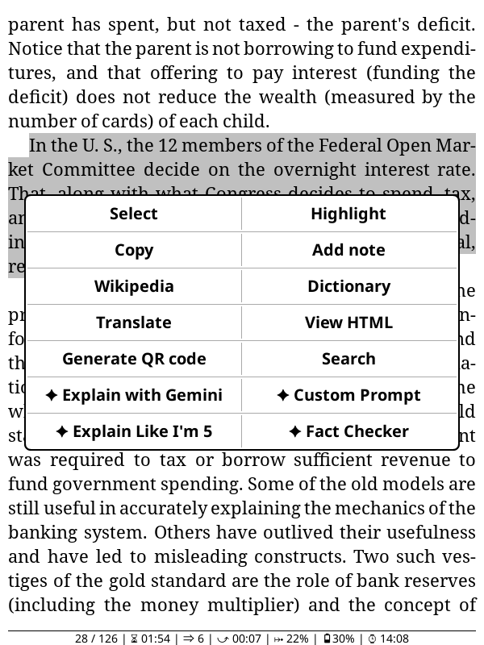
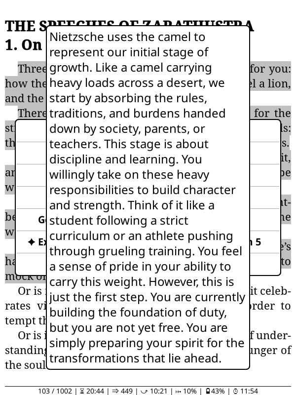

# Highlight passages from documents in Koreader and get Gemini to explain them
This is going to be a simple tool that will do a few things but do them well. There are alternatives out there for people who want large customisation in the live plugin.

  
  
  
  
  

## Features
- Explain with Gemini: Generic summary and explanation prompt.
- Fact Checker: Checks claims against external fact and scrutinises propositions and arguments.
- Explain Like I'm 5: Summary and explanation taylored to a layman and containing more real-world examples and without jargon.

Read about future changes [here](FEATURE_PIPELINE.md)

## To use
> [!NOTE]
> Make sure your Kindle is connected to the internet in the Koreader network settings tab.
1. Download the repo and copy/move it into your koreader/plugins folder in your Kindle/Kobo/other e-readers storage.
2. Get your free Gemini API key in the [Gemini AI Studio](https://aistudio.google.com/).
3. In the top main menu bar, find the "Ask Gemini" settings, and use either the QR code and localhost page through your phone or manually type your Gemini API key.
4. Setup complete! To try the plugin, **highlight some text in a document and press "✦ Explain with Gemini"**

By default the plugin uses gemini-3.1-flash-lite.